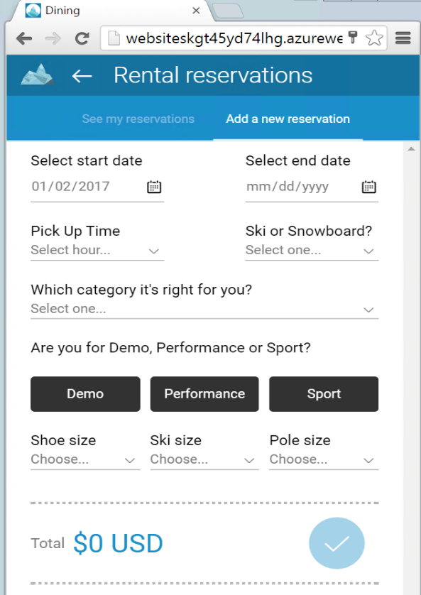
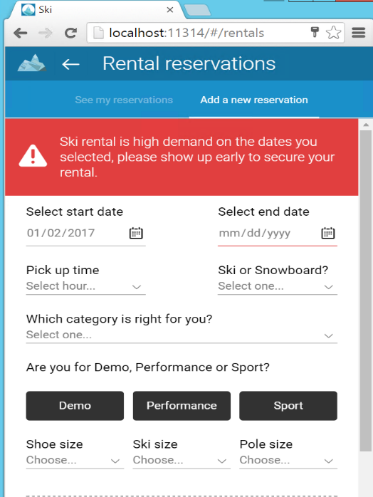

Prerequisites
=============

-   [Visual Studio 2015 Update 3](https://www.visualstudio.com/products/vs-2015-product-editions)

-   [Microsoft Azure SDK](https://www.microsoft.com/web/handlers/webpi.ashx/getinstaller/VWDOrVs2015AzurePack.appids) for Visual Studio 2015

-   [SQL Server 2016 Developer Edition](http://aka.ms/skiapp)

-   [Microsoft Azure subscription](https://azure.microsoft.com/en-us/free/)

-   [.NET Core SDK Visual Studio Tools](https://go.microsoft.com/fwlink/?LinkId=798481)

-   [Java Jdk 1.8](http://www.oracle.com/technetwork/java/javase/downloads/jdk8-downloads-2133151.html)

-   **gulp and bower installed as global**
    -   npm install bower -g
    -   npm install gulp -g

-   [Xamarin System Requeriments](https://developer.xamarin.com/guides/cross-platform/getting_started/requirements/)

-   [System Requirements for the Visual Studio Emulator for Android](https://msdn.microsoft.com/en-us/library/mt228280.aspx?f=255&MSPPError=-2147217396)

Intelligent Applications
========================

Applications show intelligence when they can spot trends, react to unusual events, predict outcomes or recommend choices. Learn how to introduce intelligence traits into your apps including: establishing feedback loops, applying big data and machine learning techniques to classify, predict or otherwise analyze explicit and implicit signals, and operationalizing the full stack into the regular usage flow of the app.

Most every day apps, from consumer to enterprise can deliver greater customer or business benefit by learning from user behavior and other signals. In this session we’ll take a pragmatic look at introducing real, useful data-driven intelligence into apps by walking through services, code and data needed to make it happen.

> 

AdventureWorks SkiResort
========================

The AdventureWorks Ski App provides a sample application that can be used to demonstrate the value of building in intelligence into an existing application. This apache cordova based intelligent mobile webapp was first demoed at //build 2016. 

It also contains a Xamarin Forms client that works on Android and iOS mobile devices.

**Basic App**

> 

**Intelligent App**

> 

> 

Microsoft Azure Services
==================================

These Microsoft Azure services are used:

- SQL Server 2016 Virtual Machine.
- Virtual Network.
- App Service.
- SQL Database.
- Stream Analytics.
- Event Hub.
- DocumentDB.
- Azure Storage.
- Search Service.
- Cognitive Services.
- Azure Machine Learning.
- Application Insights.

How to sign up for Microsoft Azure
==================================

You need an Azure account to work with this demo code. You can: - Open an Azure account for free.[Azure subscription](https://azure.com/). You get credits that can be used to try out paid Azure services. Even after the credits are used up, you can keep the account and use free Azure services and features, such as the Web Apps feature in Azure App Service. - [Activate Visual Studio subscriber benefits](https://azure.microsoft.com/en-us/pricing/member-offers/msdn-benefits-details). Your Visual Studio subscription gives you credits every month that you can use for paid Azure services. - Not a Visual Studio subscriber? Get a $25 monthly Azure credit by joining [Visual Studio Dev Essentials.](https://www.visualstudio.com/products/visual-studio-dev-essentials-vs)

Deployment & Setup
========================

1.  <a href="docs/setup/01.CreateAzureResources.md">Create Azure Resources</a>

1.  <a href="docs/setup/02.TestSQLConnection.md">Test SQL Connections</a>

1.  <a href="docs/setup/03.SetupDataScienceClient.md">Setup Daya Science client</a> 

1.  <a href="docs/setup/04.MLKeys.md">Get Machine Learning Web Service Keys</a>

1.  <a href="docs/setup/05.TestWebApps.md">Test the Web Apps</a>

1.  <a href="docs/setup/06.TestWebMobileApp.md">Test the Web Mobile App</a>

1.  <a href="docs/setup/07.EnableExternalScripts.md">Enable external scripts</a>

1.  <a href="docs/setup/08.DataGeneration.md">Data Generation</a>

1.  <a href="docs/setup/09.Xamarin.md">Xamarin</a>

1.  <a href="docs/setup/10.PowerBI.md">Power BI</a>

Demonstration 
========================
Applications show intelligence when they can spot trends, react to unusual events, predict outcomes or recommend choices. Learn how to introduce intelligence traits into your apps including: establishing feedback loops, applying big data and machine learning techniques to classify, predict or otherwise analyze explicit and implicit signals, and operationalizing the full stack into the regular usage flow of the app. 

Most every day apps, from consumer to enterprise can deliver greater customer or business benefit by learning from user behavior and other signals. In this session we’ll take a pragmatic look at introducing real, useful data-driven intelligence into apps by walking through services, code and data needed to make it happen.

1.  <a href="docs/hols/01.XamarinTour.md">Xamarin Tour</a>

1.  <a href="docs/hols/02.WebTour.md">Web Tour</a>

1.  <a href="docs/hols/03.SkiRentals.md">Ski Rentals (forecasting)</a>

1.  <a href="docs/hols/04.Lifts.md">Lifts (Anomaly detection)</a>

1.  <a href="docs/hols/05.Dining.md">Dining (Tailored experiences)</a>

