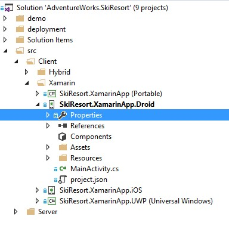
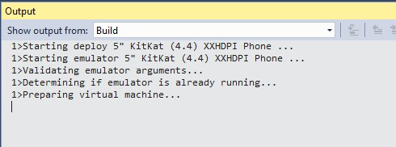
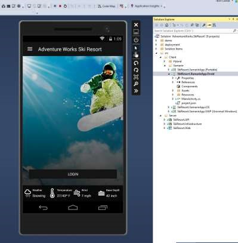
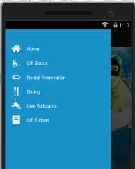
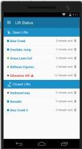
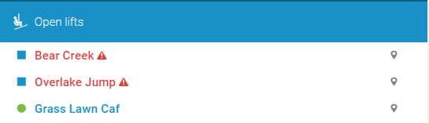
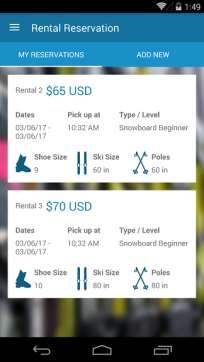
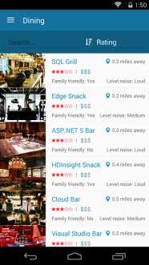
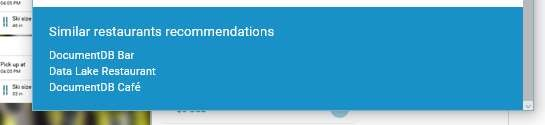
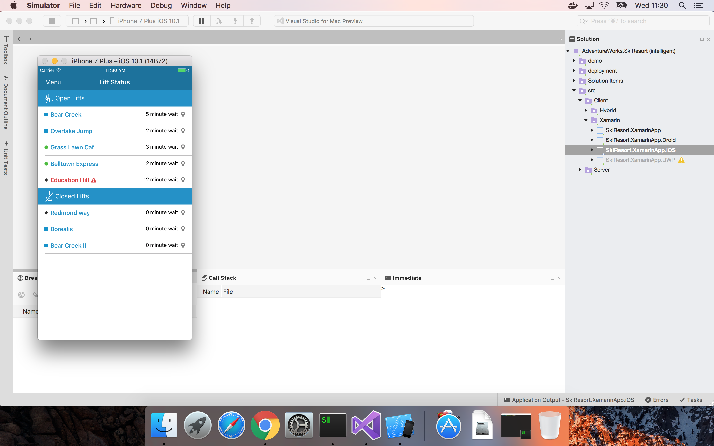

# Ski Resort Xamarin Tour

If you think about adding intelligence to an app, let's use this ski app.

For those of us who don't ski, this app is pretty straightforward. At pretty much any resort you go to, you'll find an app like this.

## Android

1.	[Check Xamarin System Requeriments](https://developer.xamarin.com/guides/cross-platform/getting_started/requirements/)

1.	[Check System Requirements for the Visual Studio Emulator for Android](https://msdn.microsoft.com/en-us/library/mt228280.aspx?f=255&MSPPError=-2147217396)

    - If you have any issue running the emulator check [Troubleshooting the Visual Studio Emulator for Android](https://msdn.microsoft.com/en-us/library/mt228282.aspx?f=255&MSPPError=-2147217396)

1.	Open the AdventureWorks.SkiResort solution.

1.	Set the Andoid project as StartUp project.

    

1.	Choose the Microsoft Android Phone emulator.

    

    You can use your own Android device if it´s connected.

1.	Build the project.

1.	Click on F5.

    

    - You can look up lift status.
    - You can check snow conditions.
    - You can look at dining options and stuff like that.

    

    - But let's just walk through three scenarios on an app that looks just like this with a before and after.

1.	Click on the menu.

    

1.	Click on `Lift Status`.

    Shows open/closed status.

    

    > **With intelligence**
        - Predicts wait time.
        - Gives warnings based on traffic.
        - Identifies anomalies.

    

1.	Click on `Rental Reservations`.
    - Displays products.
    - Handles transactions.

    

1.	Depending on the selected start day, the app shows this message.

    **With intelligence**: Predicts demand to help customers know what to expect.

    

1.	Click on `Dining`.

    - Shares menu.
    - Takes reservations.

    

    **With intelligence**: Knows where you want to eat next.

    

## Xamarin iOS on Visual Studio for Mac

1.	[Check Xamarin System Requeriments](https://developer.xamarin.com/guides/cross-platform/getting_started/requirements/)

1.	Open the AdventureWorks.SkiResort solution.

    

1.	Set the iOS project as StartUp project.

1.	Build the project.

1.	Click on F5.

## Xamarin iOS on Visual Studio 2015

1.	[Check Xamarin System Requeriments](https://developer.xamarin.com/guides/cross-platform/getting_started/requirements/)

1.	Download and install [Remoted iOS Simulator (for Windows)](https://developer.xamarin.com/guides/cross-platform/windows/ios-simulator/) if you want to test the iOS application.

    > NOTE: Remoted iOS Simulator requires a Visual Studio Enterprise license.

1.	Open the AdventureWorks.SkiResort solution.

1.	Set the iOS project as StartUp project.

1.	Build the project.

1.	Click on F5.

<a href="02.WebTour.md">Next</a>