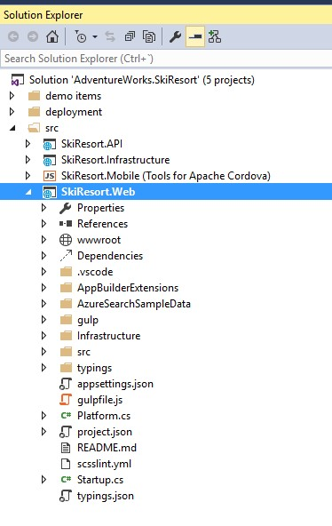
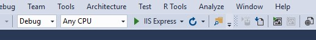
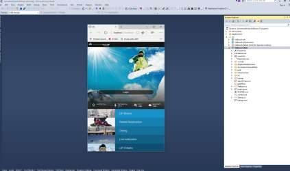
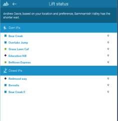
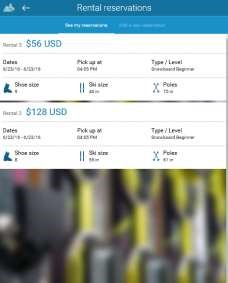
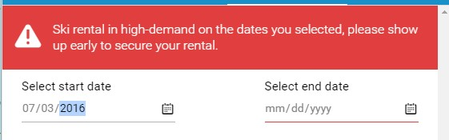
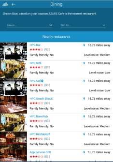

# Ski Resort Web Tour

1.	Open the AdventureWorks.SkiResort solution.

1.	Set the web project as StartUp project..

    

1.	Click on F5 in the `IIS Express` button.

    

    - You can look up lift status.
    - You can check snow conditions.
    - You can look at dining options and stuff like that.

    

    - But let's just walk through three scenarios on an app that looks just like this with a before and after.

1.	Click on `Lift Status`.

    Shows open/closed status.

    

    > **With intelligence**
        - Predicts wait time.
        - Gives warnings based on traffic.
        - Identifies anomalies.

    

1.	Click on `Rental Reservations`.
    - Displays products.
    - Handles transactions.

    

1.	Depending on the selected start day, the app shows this message.

    **With intelligence**: Predicts demand to help customers know what to expect.

    

1.	Click on `Dining`.

    - Shares menu.
    - Takes reservations.

    

    **With intelligence**: Knows where you want to eat next.

    

<a href="03.SkiRentals.md">Next</a>
