# Ski Rentals (forecasting)


What we want to achieve is to know how busy it is going to be tomorrow. 

And what we know is all of our past history.

So the interesting thing about intelligent apps is that they're intelligent not because
of being particularly sophisticated, but because they learn
from past experience.

In this case, past experience is the record of all of our history of rentals.

We have all of our years worth of rentals in a table somewhere.

This is our transactional system. You can see there in step one, that we have the the complete rental history.


1.	Open the AdventureWorks.SkiResort solution.

1.	Set the web project as StartUp project.

1.	Click on F5 or the `IIS Express` button.

1.	Click on `Rentals`.

    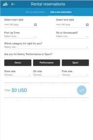

1.	Depending on the selected start day, the app shows this message.

    

1.	Click on `File>New>File`.

    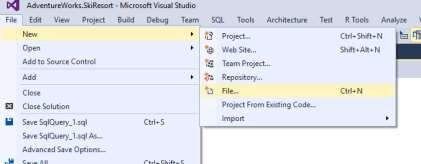

1.	Create a new `SQL` script.

    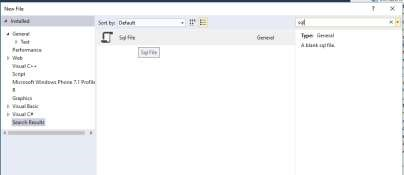

1.	Click on `Connect`.

    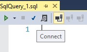

1.	Connect using SQL Server Authentication.(The data is in SQL server 2016)
    - Server: <YOUR_SQL_VM>
    - DatabaseName: AdventureWorks.SkiResort
    - Username: skiresort
    - Password: P2ssw0rd@1
    
    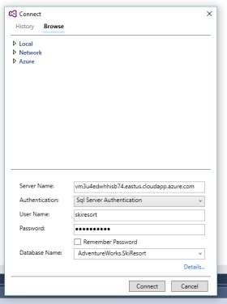

1.	List the existing rentals in the database.

    ```sql
    Select top 10 * from rental
    ```

1.	Click on Execute.

    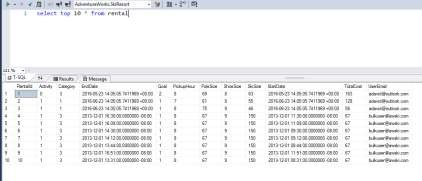

    Let's take a look at the rental stable real quick.

    This shows rentals, what types of skis, what shoe sizes there are, etc.

    From the predictive model standpoint, I don't need this level of detail.

    What I want to know everyday, is how many rentals did you have in the past and then what happened? What was the day? Did it snow the day before? How was the weather?

    An interesting thing about the newer version of SQL Server, particularly in 2016 is that a lot of work that we've been doing is around allowing you to do analytical work directly in your transactional store.

1.	Expand the `SkiResort.Infrastructure` project.

1.	Open the SkiResortDataInitializer.cs file.

    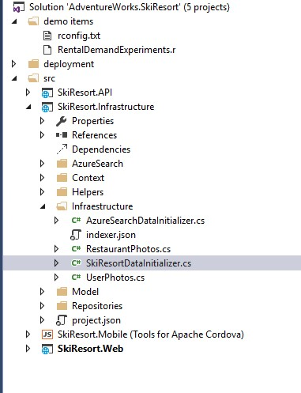

1.	Go to the `RentalFeatures` View definition.

    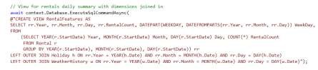

1.	Go to the SQL script.

1.	Check the View Content.

    ```sql
    Select top 10 * from RentalFeatures
    ```

1.	Click on Execute.

    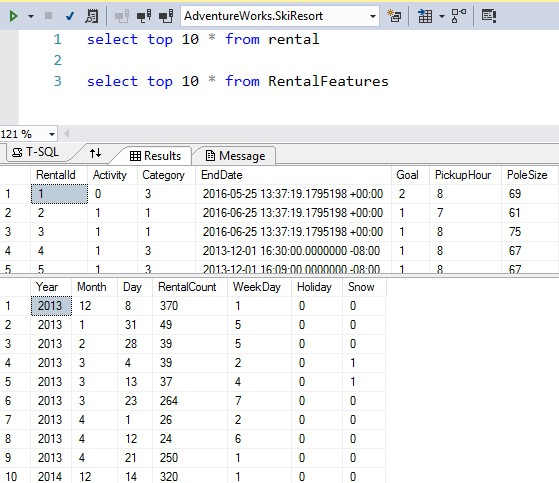

1.	Expand the `SkiResort.Infrastructure` project.

1.	Open the SkiResortDataInitializer.cs file.

1.	Go to the `INDEX` definition. 

    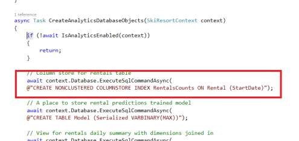

1.	Go to the SQL script.

1.	Click on `include actual execution plan`.

    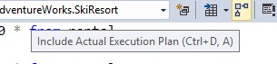

1.	Select the `RentalFeatures` query.

    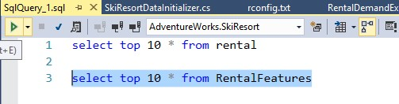

1.	Click on Execute.

1.	Go to the Execution plan window and search for the `Columnstore Index Scan`.

    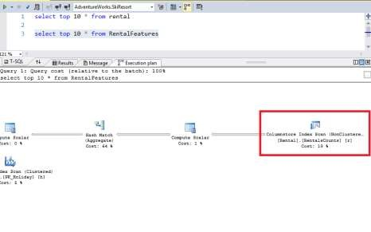

1.	Open the `demo items` solution folder.

1.	Open the R script.

    But today we're using SQL Server with R.

    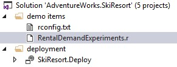

1.	Select `library(‘rpart.plot’)`

1.	Click on Execute In Interactive.

    If you get an error due to the library not being recognized, try to install it.

    Install.packages(‘rpart.plot’)

    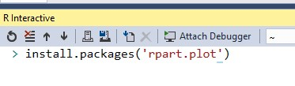

    

1.	Select the `query`.

1.	Click on Execute In Interactive.

    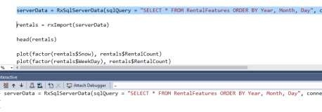

    So, now I'm gonna pull some data from the SQL Server.

    In this case, I'm gonna just pull the data down to the client.

    So if you look at this, this is the view we prepared before.

1.	Select the different queries that exist in the file and evaluate the results.

    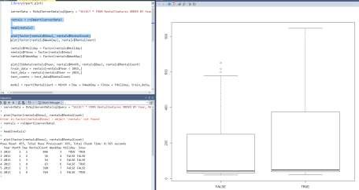

    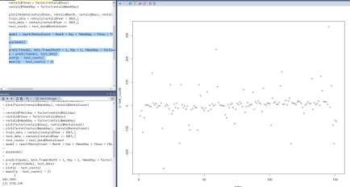

1.	Open the SQL Server Object Explorer in Visual Studio.

1.	Connect using SQL Server Authentication.
    - Server: <YOUR_SQL_VM>
    - DatabaseName: AdventureWorks.SkiResort
    - Username: skiresort
    - Password: P2ssw0rd@1

1.	Open the stored procedures folder.

    

1.	Open the PredictRentals procedure.

    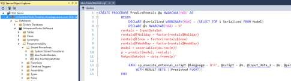

1.	Go to the Visual Studio solution.

1.	Expand the SkiResort.API project.

1.	Click on `RentalsController`.

1.	Go to the `CheckHighDemandAsync` controller.

    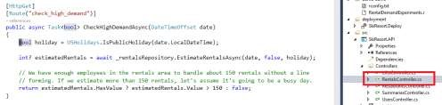

1.	Open the SkiResort.Infrastructure project.

1.	Open the SkiResortContext.cs class.

1.	Go to the `EstimateRentalsAsync` controller.

    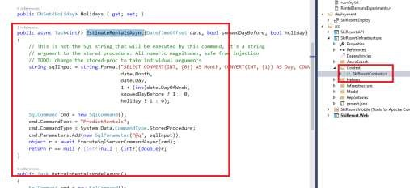

<a href="04.Lifts.md">Next</a>