# Lifts (Anomaly detection)

Shows open/closed status.

**With intelligence**
- Predicts wait time.
- Gives warnings based on traffic.
- Identifies anomalies.

1.	Open SkiResort.DataGeneration.sln solution. (src\SkiResort.DataGeneration directory)

    gen-skilocations simulates skiers movement around the mountain by continuously moving them from the bottom of chairlifts to the top and back. The location events are pushed to an event hub that’s then consumed by Stream Analytics. 

    Imagine the skier sending their latitude, longitude and event time continuously…(the gen-skilocations app is running)

1.	Click on `Ctrl + F5` to run the application without debugging.

    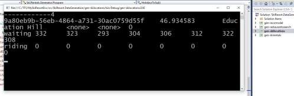

1.	Go to the AdventureWorks.SkiResort solution.

1.	Expand the SkiResort.Infrastructure project.

1.	Open the Lift.cs file to check the Lift properties.

    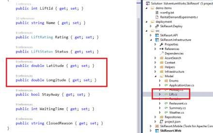

1.	Go to the Microsoft Azure portal.

    I created an event hub and then I hooked up Azure stream analytics into that event hub.

1.	Search for your Resource Group.

1.	Click on the Stream Analytics Services.

    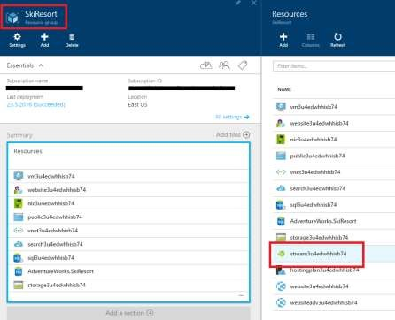

1.	Click on the output to view the configuration.

    I can pull data that is being generated from all these places and land it neatly organized in one place.

    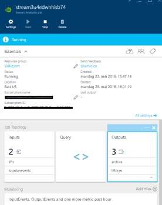

    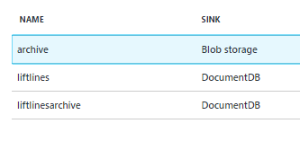

1.	Click on `Query`.

    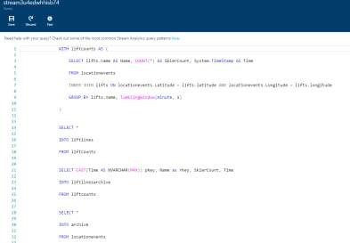

    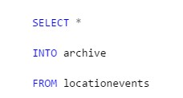

    I look at the query.

    I'm storing this in BLOBs and in a Cosmos DB databases. 

    

1.	Open the Visual Studio Cloud Explorer.

    Allows us to see the storage account.

1.	Open your Resource Group.

1.	Open the Storage Service.

1.	Open the blob to check the outputs of the Stream Analytics services.

    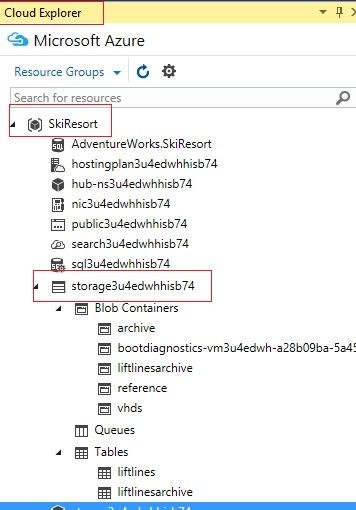

1.	View the content of the archive container.

    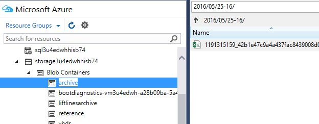

    So, you can see how stream analytics has taken all of these, and packed them in single files in sub CSVs.

    

    So look at this query for a minute.

    So what we're saying is, is that we're quitting the location events data stream.
    In stream analytics, we support pulling in reference data. In this case, my reference data set is the locations of all of the bases of the chair lifts.

1.	Now, view the content of Document databases.

1.	Go to the Azure Portal and check on the Cosmos DB service.

    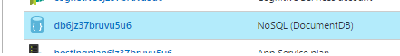

    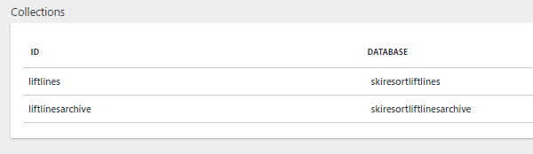

1.	Click on the Query Explorer.

1.	View the content of liftlinearchive table.

    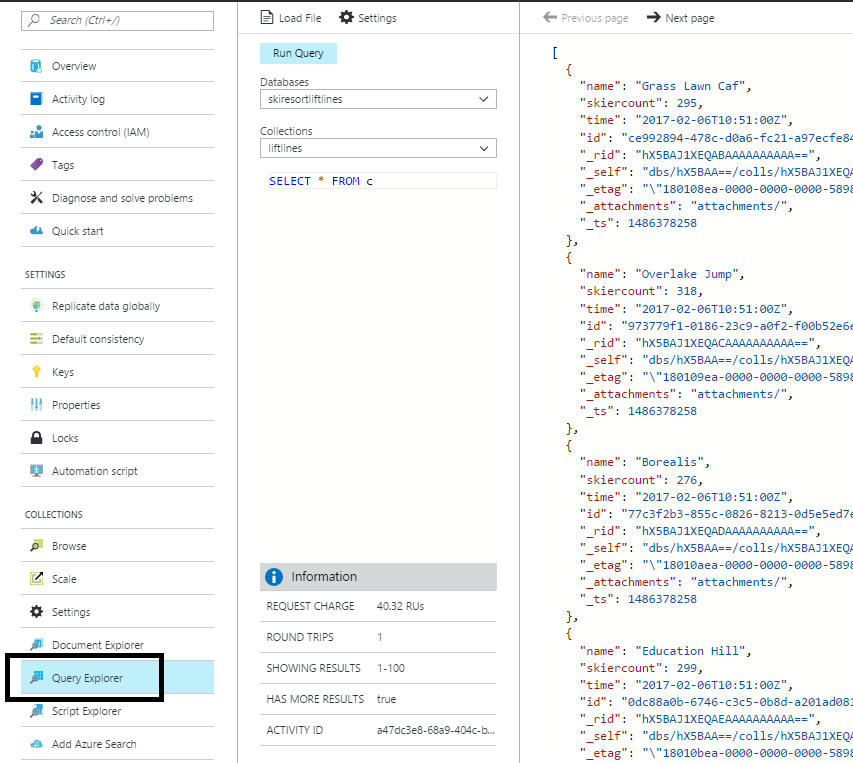

1.	Click on SkiResort.API.

1.	Click on LiftController.cs

1.	Go to the `GetNearByAsync` controller.

    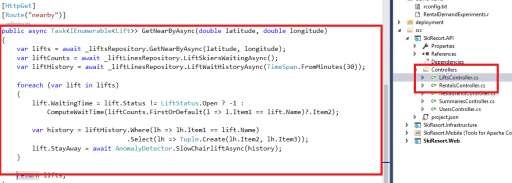

    We can start to predict wait times, and maybe even detect anomalies to redirect them to different part of the mountain.

1.	Go to the definition of the `SlowChairLiftAsync`.

    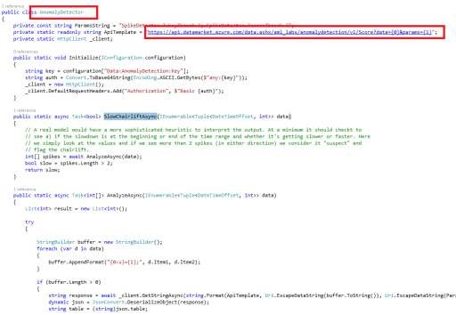

    Here I use the anomaly services that are available in the data services marketplace.

<a href="05.Dining.md">Next</a>