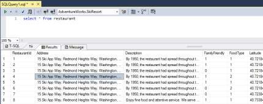
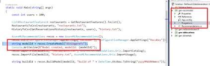
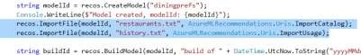
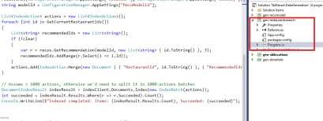
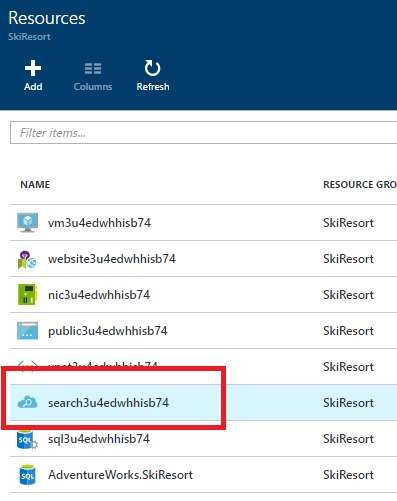
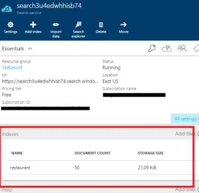
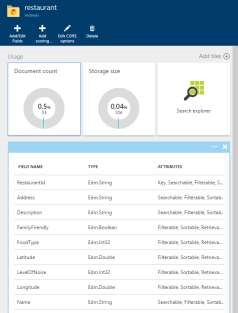
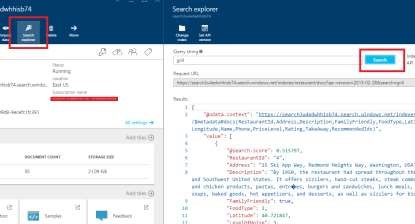

# Dining (Tailored experiences)

Shares menu.
Takes reservations.

**With intelligence**: Knows where you want to eat next.

1.	Open the SQL script, the same as you opened in the previous step.

1.	List the restaurants.

    ```sql
    Select * from restaurant
    ```

1.	Click on execute.

    

1.	Open SkiResort.DataGeneration.sln solution. 

1.	Expand the gen-recomodel project.

    geo-recomodel: given 2 inputs (restaurant list, user restaurant attendance) creates a recommendations model in the pre-built AzureML recommendations API. It uses the recommendations data service created in the first steps.

1.	Opent the program.cs file.

    

    

1.	Expand the geo-restaurantsearch project.

    geo-restaurantsearch runs all restaurants by the recommendations API, retrieves a list of recommended restaurants for each one, and pushes the list of recommended/related restaurants to the Azure Search index.

1.	Open the program.cs file.

    

1.	Go to the Azure Portal.

1.	Go to the Resource Group.

1.	Click on the Search Service.

    I use a Search Service in Azure.

    

1.	Click on the `restaurant` index.

    

    I have this restaurant index that has all of the typical things you would find from a search index for restaurants.

1.	Click on `Search explorer`.

    

1.	Write `grill` and click on search.

    

    Try out the search index.

<a href="..\..\README.md">Next</a>