# Create Azure Resources

1.	Open AdventureWorks.SkiResort solution.

    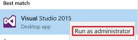

1.	Expand the deployment `deployment` solution folder.

    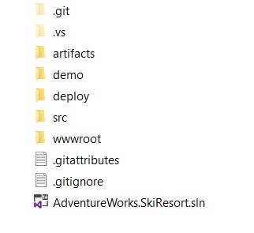

1.	Expand the SkiResort.Deploy project.

    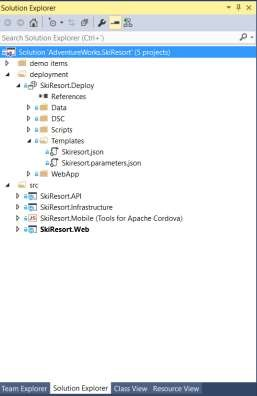

1.	Click on the Skiresort.parameters.json file.

1.	By default,Azure Search uses a free pricing tier (Shared cluster). You can only create one Search service at the free pricing tier. Change to “basic” or “standard” if you already have a free search service in your azure subscription.

    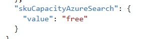

1.	The Azure ML Web Services provide multiple tiers that you can use to provision your billing plan. The dev/test tier is a tier that provides limited included quantities that allow you to test your experiment as new web service without incurring costs. You can only create one Azure ML Web Services  at the dev/test tier. Change to `S1` if you already have a dev/test service in your azure subscription

    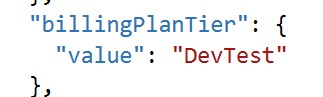

1.  The project contains an ARM template (skiresort.json) to create all the Azure Resources needed in the demo environments.

    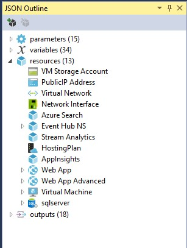

1.	Click on the SkiResort.Deploy.

    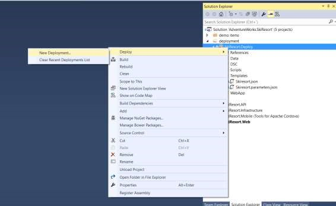

1.	Click on deploy.

1.	Add your Microsoft Azure account or choose the credentials that you want to use if you are already logged in.

    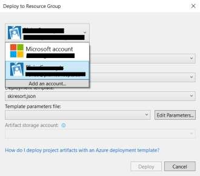

1.	Choose your Azure Subscription.

    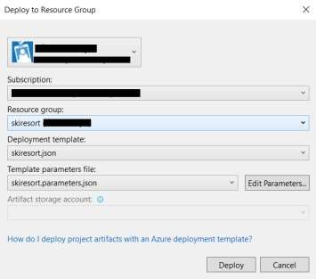

1.	Select the Resource group that you created before.

1.	Choose the skiresort.json files as a deployment template.

1.	Choose the skiresort.parametes.json files as template parameters.

1.	Click on Deploy.

    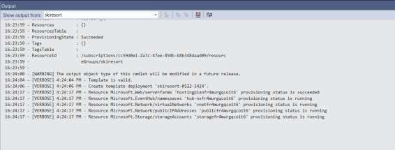

1.	Check the output window to follow the process. The process will take several minutes (20-30 minutes).

1.	After finishing the process, the output window will show the URI of the webapps deployed and the connection string to the SQL Server VM that is created.

    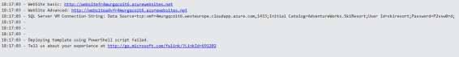

1.	Copy the URL (Website basic).

1.	Open a browser and paste the URL (The database and sample data is created the first time you navigate. The creation process may take a few minutes)

    

1.	By default, the credentials are:
    - Username: skiresort
    - Password: P2ssw0rd@1

1.	Copy the second URL (Website advanced).

1.	Open a browser and paste the URL.

1.	By default, the credentials are:
    - Username: skiresort
    - Password: P2ssw0rd@1

1.  In your Azure subscription you will have something similar to the picture. 

    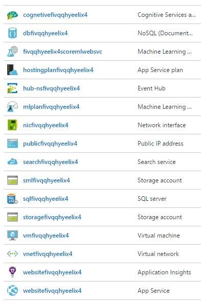

<a href="02.TestSQLConnection.md">Next</a>
