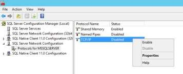
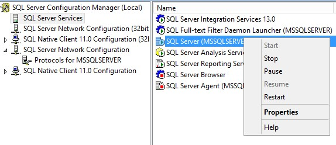
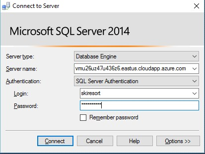

# Test SQL Connection

1.	Click on the virtual machine. 

    

1.	Click on `Connect`. 
 
    NOTE: You may receive an error telling that it is not possible to connect because the remote machine may be shut down. Wait a few moments and try again. This is because it is still restarting due to the SQL Server installation. 

    - Username: skiresort 
    - Password: P2ssw0rd@SkiResort  

    

1.	In the Virtual Machine, open SQL Server Management Studio. 

    

1.	Connect using SQL Server Authentication. 
    - Username: skiresort 
    - Password: P2ssw0rd@1 
 
    NOTE: The first time the Server will NOT contain any database. The first time that you run the web app in your local environment the database will be created. 

1.	Open SQL Server 2016 Configuration Manager. 

1.	Click on Protocolos for MSSQLSERVER.

1. Open SQL Server Configuration Manager. 

1.  Enable TCP/IP protocol. 
 
    

1.	Click on SQL Server Services 

1.	Restart the SQL Server service. 

    

1.	Start the `LaunchPad` service if it´s stopped. 

1.	Open SQL Server Management Studio in your local computer. 

1.	Try to connect to the remote SQL Server that is hosted on Microsoft Azure. (Your corporate firewall should allow SQL remote connections, port 1433) 
 
    

1.	Connect to the server using SQL Server Authentication. 
    - Servername: <VM public DNS name> 
    - Username: skiresort 
    - Password: P2ssw0rd@1 
 
    NOTE: If there is any issue with these steps, connect to the server using RDP and enable remote connections in SQL Server 2016

<a href="03.SetupDataScienceClient.md">Next</a> 
 
