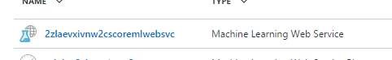
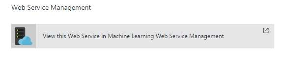
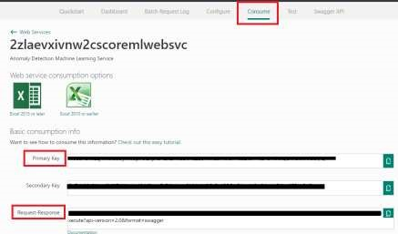

# Get Machine Learning Web Service Keys

1.  Go to your Microsoft Azure subscription. 

1.  Click on `Resource groups`. 

1.  Search for the resource group that you created before. 
 
1.  Click on the Machine Learning Web Service. 

    
 
1.  Click on Machine Learning Web Service Management.

     

1.  Click on consume. 

    

1.  Copy the primary key and Request-Response URI to use later. 

<a href="05.TestWebApps.md">Next</a>