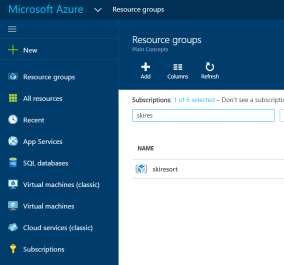
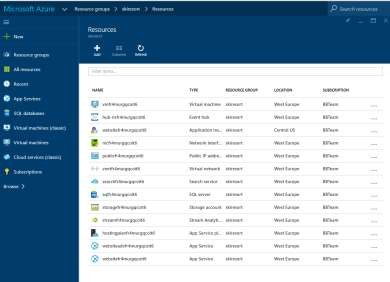
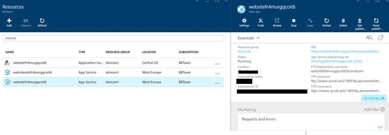
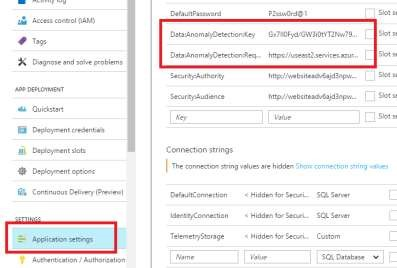
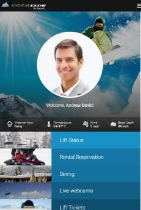

# Test the Web Apps 

1.	Go to your Microsoft Azure subscription. 

1.	Click on `Resource groups`.

1.	Search for the resource group that you created before.

    

1.	Click on the resource group to view all of the existing resources.
    - SQL Server 2016 Virtual Machine.
    - WebApps.
    - Virtual Network.
    - Search Service.
    - Stream Analytics.
    - Event Hub.
    - Application Insights.
    - Cognitive Services.
    - AzureML
    - PowerBI
    - ….

    

1.	Click on the second website, the one that has the `adv` key in the its name.

    

1.	Click on Application Settings.

    

1.	Update the anomaly service settings with the `primarykey` and `Request-Response` URI of the Machine Learning Web Service.

1.	Click overview and click on the URL to open the application. (The AdventureWorks.SkiResort database will be created in the SQL Server VM)

    

<a href="06.TestWebMobileApp.md">Next</a>