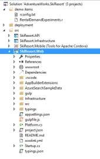
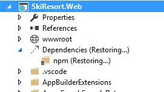
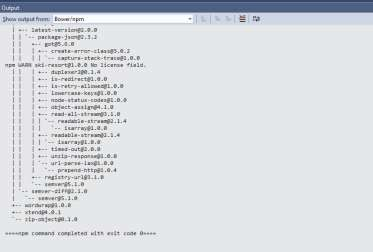
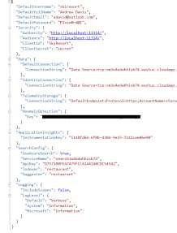
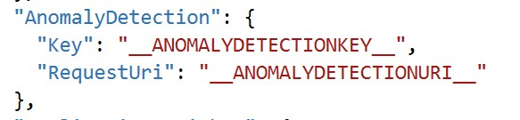
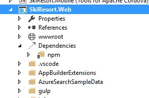

# Test the Web Mobile App 

1.	Open the AdventureWorks.SkiResort solution.

    

    NOTE: The first time you open the Visual Studio solution will restore the web project dependencies.

    

    

1.	Expand the SkiResort.Web project.

1.	Click on the `appsettings.json` file to update the anomaly detectation keys.

    

1.	Update your settings with the `primarykey` and `Request-Response` URI of the Machine Learning Web Service.

    

1.	Set the web project as StartUp project.

    

1.	Click on F5 or in the `IIS Express` button.

    

1.	By default, the credentials are:
    - Username: skiresort
    - Password: P2ssw0rd@1

    

<a href="07.EnableExternalScripts.md">Next</a>