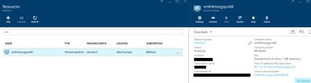
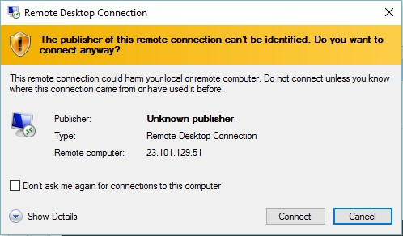
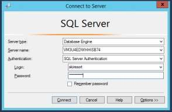
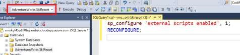

# Enable External Scripts

1.	Click on the virtual machine.

    

1.	Click on “Connect”.
    - Username: skiresort
    - Password: P2ssw0rd@SkiResort

    

1.	In the Virtual Machine, open SQL Server Management Studio.

1.	Connect using SQL Server Authentication.
    - Username: skiresort
    - Password: P2ssw0rd@1

    

1.	Enable external scripts running this command:

    ```sql
    sp_configure 'external scripts enabled', 1;  
    RECONFIGURE; 
    ```

    

1.	Restart the SQL Server Service.

<a href="08.DataGeneration.md">Next</a>