# Model and sample data generation

1.	Open the SkiResort.DataGeneration.sln solution. (src\SkiResort.DataGeneration directory)

    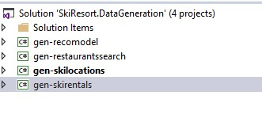

1.	Set `gen-skiretals` as StartUp project.

    gen-skirentals generates ski rentals records for the last few years into an SQL table.

1.	Click on App.config file. The ConnectionString uses the SQL Server hosted on Azure.

    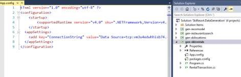

1.	Click on F5.

1.	Wait to finish.

    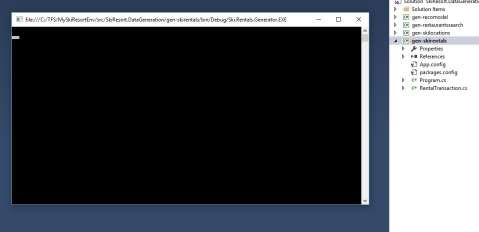

1.	Set `gen-skilocations` as the StartUp project.

    gen-skilocations simulates skiers movements around the mountain by continuously moving them from the bottom of chairlifts to the top and back. The location events are pushed to an event hub that is then consumed by Stream Analytics. 

1.	Click on App.config file to check that the EventHub connectionstring is configured.

    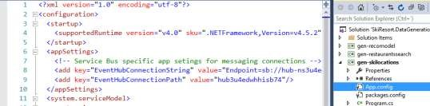

1.	Click on `Ctrl + F5` to run the application without debugging.

    The application will continuously send the events without stopping.

    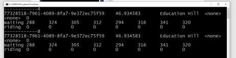

1.	Stream Analytics consumes the events to process and store them in three different outputs.

    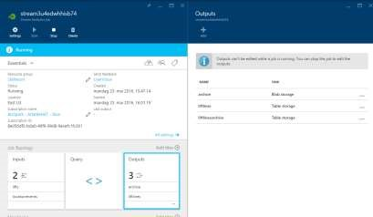

    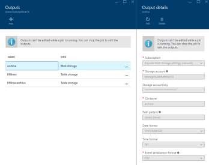

1.	Set `gen-recomodel` as StartUp project.

    geo-recomodel: giving 2 inputs (restaurant list, user restaurant attendance) creates a recommendations model in the pre-built Cognitive Services recommendations API. It uses the recommendations data service created in the first steps.

1.	Click on App.config file to check that the connectionstring  and recommendations key are configured.

    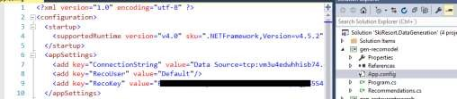

1.	Click on `Ctrl + F5` to run the application without debugging.

1.	Copy the modelId. You will need it later.

    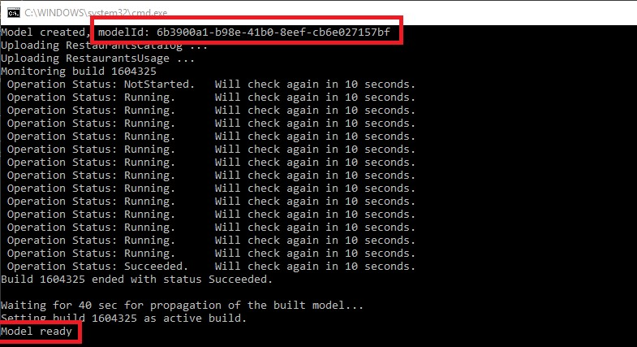

1.	After creating the model the application is able to read the RestaurantId and search for the service recommendations.

1.	Click `1`.

1.	Click `2`.

    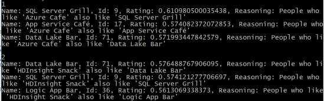

1.	Set `gen- restaurantsearch` as the StartUp project.

    geo-restaurantsearch runs all restaurants by the recommendations API, retrieves a list of recommended restaurants for each one, and pushes the list of recommended/related restaurants to the Azure Search index.

1.	Click on App.config file.

    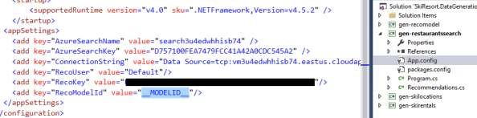

1.	Update the RecoModelId with the value copied in the previous step.

1.	Click on `F5`.

1.	Open SQL Server Management Studio.

1.	Connect your database using SQL Server Authentication.
    - Username: skiresort
    - Password: P2ssw0rd@1

1.	Run the store procedure `TrainRentalModel`.

    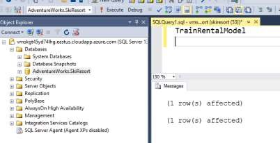

<a href="09.Xamarin.md">Next</a>
