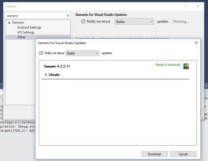
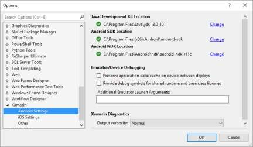

# Xamarin

1.	[Check Xamarin System Requeriments](https://developer.xamarin.com/guides/cross-platform/getting_started/requirements/)

1.	[Check System Requirements for the Visual Studio Emulator for Android](https://msdn.microsoft.com/en-us/library/mt228280.aspx?f=255&MSPPError=-2147217396)

1.	Open Visual Studio.

1.	Go to Options>Xamarin>Other.

    

1.	Check for updates.

1.	Click on Android Settings.

1.	Be sure that the Java jdk 1.8 is used.

    

1.	Open Android Sdk Manager.

    

1.	Install the latest version of the Android Sdk tool, Sdk platform tools and Sdk build tools.

    

1.	Download and install [Remoted iOS Simulator (for Windows)](https://developer.xamarin.com/guides/cross-platform/windows/ios-simulator/) if you want to test the iOS application.

    > NOTE: Remoted iOS Simulator requires a Visual Studio Enterprise license.

<a href="10.PowerBI.md">Next</a>

