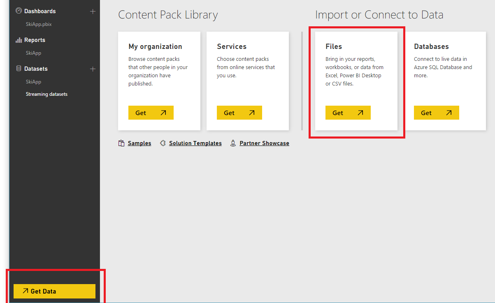
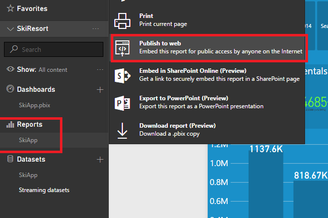
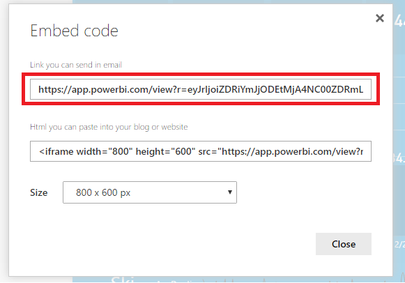
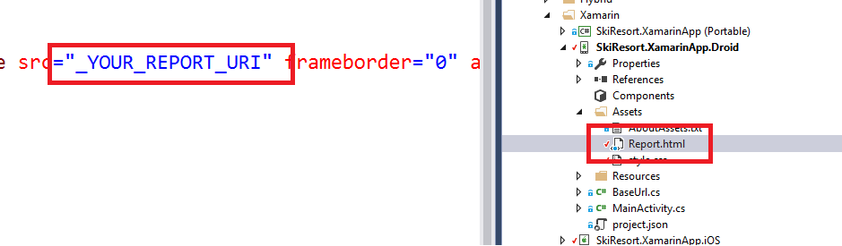

# Power BI

1.	Go to the [Power BI home page](https://powerbi.microsoft.com)

1.  Sign in.

1.  Import the reports\SkiApp.pbix file.

    

1.  Click on the imported report and click on "publish to web".

    

1.  Copy the generated URI and go to the AdventureWorks.SkiResort solution.

    

1.  Expand the SkiResort.XamarinApp.Droid project and click on assets\Report.html file.

    

1.  Update the report URI.

1.  Expand the SkiResort.XamarinApp.iOS project and click on Resources\Report.html file to update the report URI.

<a href="..\..\README.md">Next</a>